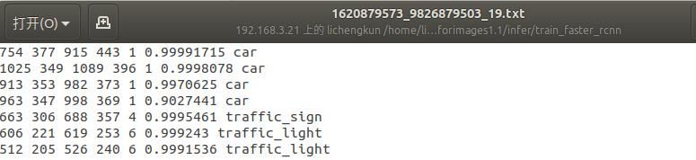
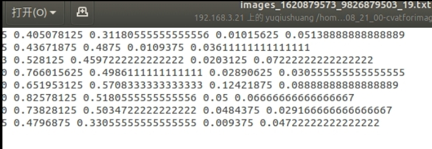
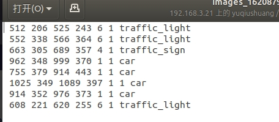

# 预标注数据集
### 项目介绍
主要目的是将还没有标注的数据集，通过模型进行一部分目标的预标注，从而提高标注效率。目前初版预标注功能已经实现，后续在提高预标注框的回归精度上可以再进行改进。整个项目要求输入为待标注数据集（图片格式），输出为标注了一部分的数据集（该数据集会输出为xml文件，注意，一个数据集只生成一个xml文件）。
在实际中，输入要求为各个独立模型对待标注的数据集的预测结果，目前除darknet 版yolov4这个模型之外，其余模型均将预测结果保存为txt（具体如下介绍），输入准备好后，参考test_wbf.py中的要求进行设置并执行test_wbf.py，即可输出所需的xml文件。
本repo中，主程序[test_wbf.py](http://git-rd.trunk.tech/yuqiushuang/multi-model-ensemble/-/blob/master/test_wbf.py)也可以输出WBF多模型融合后各项评价指标，例如：不同confidence限制条件下，各类precision等。repo中还有一些辅助功能的脚本文件，下文会做简单介绍，具体功能请查看脚本内容。

## 目录
1. [预标注步骤介绍](#summary)
    1. [输入数据格式](#design_planning)
    1. [test_wbf.py 脚本配置步骤](#design_control)
1. [评价指标计算](#design)
    1. [测试评价指标时的具体步骤](#design_planning)
    1. [`cal_draw_iou.py`的执行步骤](#design_planning)
1. [WBF源码修改](#design)
1. [其他脚本介绍](#implementation)
    1. [将GT数据集转化为TXT输入接口格式](#impl_planning)
	1. [生成包含图片绝对路径的txt文件](#impl_control)
	1. [计算某一模型预测结果与GT之间的pre,rec和ap](#impl_control)

## 预标注功能步骤 <a name="summary"></a>

### 输入数据格式

（1）输入的数据应为为已经通过独立模型检测之后的结果，接口格式如下：

- txt格式：以图片名命名
`前四个值分别为左上右下的坐标  confidence label`

 
- json格式：目前仅支持yolo预测生成的json文件，内容参考如下：

`/home/yuqiushuang/dataset/detection/badcase/new_val5392_result.json`

目前的yolo只可以用如下命令批量预测图片：（官方上只找到了单张图片预测，后续可以自己修改源码或者添加脚本，实现批量预测并保存预测后带有bbox等信息的图片）

`./darknet detector test /home/yuqiushuang/darknet/build/obj.data /home/yuqiushuang/darknet/cfg/yolo-obj.cfg /home/yuqiushuang/darknet-master/weight/yolov4_side_weight/yolo-obj_best.weights -ext_output -dont_show -out /home/yuqiushuang/dataset/detection/badcase/new_00_result.json < /home/yuqiushuang/dataset/detection/new_00.txt`

其中`/home/yuqiushuang/dataset/detection/badcase/new_val5382_result.json`是预测的结果文件；

`/home/yuqiushuang/dataset/detection/new_00.txt`是含有待预测图片的绝对路径txt，可以用folder下的`gen_img_txt.py`生成。（json和txt文件均在本地文件夹查看）

（2）输出格式：

- xml格式示例文件：`/home/yuqiushuang/dataset/detection/badcase/new_5392.xml`（在本地文件夹查看）

### test_wbf.py 脚本配置步骤

- 以下提到的参数部分后面的具体路径都是示例，具体存在哪个位置可以自行决定

（1）如果有yolov4的模型预测结果，请将其json文件放在这里`ori_json_file='/home/yuqiushuang/dataset/detection/badcase/new_00_result.json'`；

（2）其他模型预测的txt结果文件，添加在此处`ori2_txt_file = '/home/lichengkun/dataset/task_trunk_highway_l4_right_normal_bright_20210514_1-2021_05_18_08_21_00-cvatforimages1.1/infer/train_cascade/'`,如果有多个模型，就按照此格式多加几个；

 (3) 待预测数据集图片文件夹路径添加在此处`img_file = '/home/yuqiushuang/dataset/task_trunk_highway_l4_right_normal_bright_20210514_1-2021_05_18_08_21_00-cvatforimages1.1/JPEGImages/'`；

 - `test_wbf.py`中`label_tuple`里添加的是数据集里目标的种类，目前不需要修改，在代码中，它是通过index来查找名称的，需要修改时，自行查看代码进行修改。

（4）数据集的参数设置如下

```
img_width = 1280
img_height = 720
prestrain_conf = 0.96 #前面说的那个目前可以调整的模型输出的置信度（confidence）
weights = [1,2,2] #各模型的权重分配，模型是按顺序添加的，所以权重顺序也要一一对应，这里只是一个示例，有几个模型就有几个权重值，示例里是三模型融合，所以有三个值
final_result  = '/home/yuqiushuang/dataset/detection/badcase/labelme/new_00_wbf_cascade_0.95/'# labelme标注图片存放的路径
```

（5）WBF参数设置

```
iou_thr = 0.6
skip_box_thr = 0.0001
sigma = 0.1

```

(6)添加多个模型的预测结果

```
#model1,2,3预测出的bbox,label,confidence等信息
b_box_list1,label1,conf1 = add_json_model(ori_json_file,img_name)
b_box_list2,label2,conf2 = add_txt_model(ori2_txt_file,img_name,img_width,img_height)
b_box_list3,label3,conf3 = add_txt_model(ori3_txt_file,img_name,img_width,img_height)

# 进行多模型融合ensemble 
boxes_list = [b_box_list1,b_box_list2,b_box_list3]
scores_list = [conf1,conf2,conf3]
labels_list = [label1,label2,label3]
```
(7) `cov2labelme`函数一次将一张图片转化为labelme格式文件,可以选择输出限制`prestrain_conf`为多少的那些框;

(8) `generate_xml`函数将数据集全部转化为预标注的xml文件，`xml_save_path`里的xml文件就是最后预标注的结果。

注：

## 评价指标计算 <a name="design"></a>
WBF直接融合后的结果对于预标注来讲精度是不够的，需要提高WBF融合后结果的精度，目前可以调整的量是融合后模型输出的置信度（confidence），要在已知GT的数据集上进行验证，测试precision等评价指标，经实验发现预测框与groud truth的iou大于0..9时才能满足预标注要求，所以我们需要测试不同confidence下iou为0.9时的precision。

### 1. 测试评价指标时的具体步骤：（在test_wbf.py中需要修改的地方）

前三步和`test_wbf.py 脚本配置步骤`中都一样；

（4）在评价的时候是需要有GT才可以计算的，所以在计算评价指标时一定有GT的文件，该文件和上述所说的其他模型预测的txt结果文件格式一致，路径添加在此处`gt_txt_file = '/home/yuqiushuang/dataset/detection/task_trunk_highway_l4_right_normal_bright_20210514_1-2021_05_18_08_21_00-cvatforimages1.1/new_00_txt/'`生成GT的脚本参考`newdata2txt.py`,下文会有解释；

                                  
（5）数据集的参数设置除了`test_wbf.py 脚本配置步骤`（4）中的配置以外，还有添加如下内容

```
iou_thresh = 0.9#在有GT的时候，计算precision输入的iou值

```

（6）WBF参数设置，同上


(7)添加多个模型的预测结果，同上


(8) 只计算评价指标的时候把`cov2labelme`和`generate_xml`两个函数注释掉；

(9) 输出内容如下：

```
print('pre :',pre_category)
print('rec :', rec_category)
print('wbf一共预测出来多少框:',wbf_bboxes_count)#统计wbf一共预测出多少个框
print('wbf{}框的数量:'.format(prestrain_conf),wbf_conf_count)
print('wbf结果conf:{}每一类框的数量:'.format(prestrain_conf),wbf_label_count_dict)

```

注：这里输出的`wbf_label_count_dict`是限定的confidence下各类的框的数量，和iou没有关系，iou是为了计算precison设定的，但我们也要统计在限定的confidence下，各输出的融合框与GT直接iou的分布情况，每类的框在不同iou阈值区间下各有多少个。要完成这一功能，需要使用下面介绍的`cal_draw_iou.py`。

### 2. `cal_draw_iou.py`的执行步骤：

（1）将GT的txt结果文件，添加在此处`gt_bbox = '/home/yuqiushuang/dataset/detection/task_trunk_highway_l4_right_normal_bright_20210514_1-2021_05_18_08_21_00-cvatforimages1.1/new_00_txt/'`；

 (2) 将生成的labelme可读格式的图片文件夹，添加在此处`pre_bbox = '/home/yuqiushuang/dataset/detection/badcase/labelme/new_00_wbf_0.95/'`，这里labelme格式的图片文件是限定confidence后输出的，所以在执行当前脚本的时候不需要再输入和confidence相关的参数；

（3）设置`iou_threshold = 0.9`相应的值，表示在该iou阈值下各类别各有多少框，如果想要计算不同iou下各类别各有多少框，就修改这里的值然后重新跑，即可得出结果；

注：

- 在confidence很高的情况下如果出现了与GT之间的iou小于0.6，可以去除这个地方的注释把图片名字打印出来，然后去对应的文件夹看看GT和prediction的结果，分析一下造成iou这么小的原因是什么：

```
 if iou_max <0.6:
    print(iou_max, ':', gt_name)   
```

 - 如果想要可视化bbox和confidence，将画上GT的图片文件夹路径，添加在此处`gt_img_file = '/home/yuqiushuang/dataset/detection/new_00_draw_gt/'`，注意这里是把GT画到原图上之后的图片，怎样在原图上画图用`gt_draw_rectangle.py`这个脚本；

 - 最后可视化的结果，放在`result_file = '/home/yuqiushuang/dataset/detection/badcase/labelme/new_00_wbf0.95_iou0.9/'`,最后的文件夹名称建议根据confidence和iou命名，然后将这里的注释去掉

 ```
# if iou_max > iou_threshold:#把所有大于iou阈值的都画出来
#     cv2.rectangle(img,(int(xtl),int(ytl)),(int(xbr),int(ybr)),(0,255,0),1)
#     #cv2.putText(img,label,(int(xtl),int(ytl)),cv2.FONT_HERSHEY_COMPLEX_SMALL,1,(0,255,0),1)
#     iou_max = 0
#     path_name = result_file + pre_name + '.jpg'
#     cv2.imwrite(path_name,img)   
# else:
#     continue
 ```

## WBF修改部分

[WBF原理介绍请戳这里](https://github.com/ZFTurbo/Weighted-Boxes-Fusion)，在这里不再赘述，这一部分主要说一下目前项目修改的源码部分。

`ensemble.py`是从原作者那里复制过来的主程序包含了不止WBF一种模型方法，还有常见的NMS,soft-NMS等，`ensemble_wbf.py`是WBF的主程序，我们使用WBF就是调用的这个程序。

 WBF中的weight本身设置时是对confidence和bbox都进行加权，这里我们做的改动是把对confidence的加权和对bbox的加权分开了，具体在`ensemble_wbf.py`上的改动如下：

`prefilter_boxes`函数第95行，修改为：
`b = [int(label), float(score), weights[t], t, x1, y1, x2, y2]`

`get_weighted_box`函数第118行，添加了：

`wbf_conf = 0#用于坐标融合时候除的`

第112行，修改为：
`box[4:] += (b[1]*b[2] * b[4:])`

第125行添加了：
`wbf_conf += b[1]*b[2]`

第137行添加了：
`box[4:] /= wbf_conf`

`weighted_boxes_fusion`函数第226行，修改为：
`weighted_boxes[i][1] = weighted_boxes[i][1] * min(len(weights), len(clustered_boxes)) /len(weights)`

目前程序使用的WBF是没有添加这个改动的版本，如果需要改成这种方式，按照上述修改即可。

## 其他脚本介绍 <a name="design_planning"></a>

### 将GT数据集转化为TXT输入接口格式

（1）newdata2txt.py

此脚本用于将GT数据集转化成上述提到的输入接口格式，目的是为了和其他模型接口统一，输入的是把训练yolov4网络时的数据集txt文件转化所需的txt，每一个txt就是一张图片，内容包括：`归一化后的bbox(左上和右下坐标)，categrory_id, confidence , label`, 输入的地址添加在`txt_foler = '/home/yuqiushuang/dataset/task_trunk_highway_l4_right_normal_bright_20210514_1-2021_05_18_08_21_00-cvatforimages1.1/labels/'`

数据集原始txt包含的是`label xcenter ycenter width height`,都是归一化之后的

数据集原始txt          |   转化后标注的txt格式                       |   
:------------------------------:|:-----------------------------:
 | 


变形之后和输入接口中介绍的txt格式一样

（2）gen_file.py

此脚本也用于将GT数据集转化成上述提到的输入接口格式，输入的是数据集中annotation文件夹里的json文件，地址添加在`ori_json_file='/home/yuqiushuang/dataset/detection/TRUNK_highway_20210511_side_coco/annotations/train.json'`

此脚本和上一个脚本都是把GT数据集转化为统一的txt格式，区别是第一个脚本的输入是训练yolov4网络时的数据集txt文件， 第二个是数据集中annotation文件夹里的json文件。

### 生成包含图片绝对路径的txt文件

(3) gen_img_txt.py

生成只有数据集图片绝对路径的txt文件用的脚本，存到`f.txt`这个文件里，输入是数据集中annotation文件夹里的json文件


### 计算某一模型预测结果与GT之间的pre,rec和ap

(4) cal_eval_index.py

此脚本计算融合之前某一模型预测结果与GT之间的pre,rec和ap


